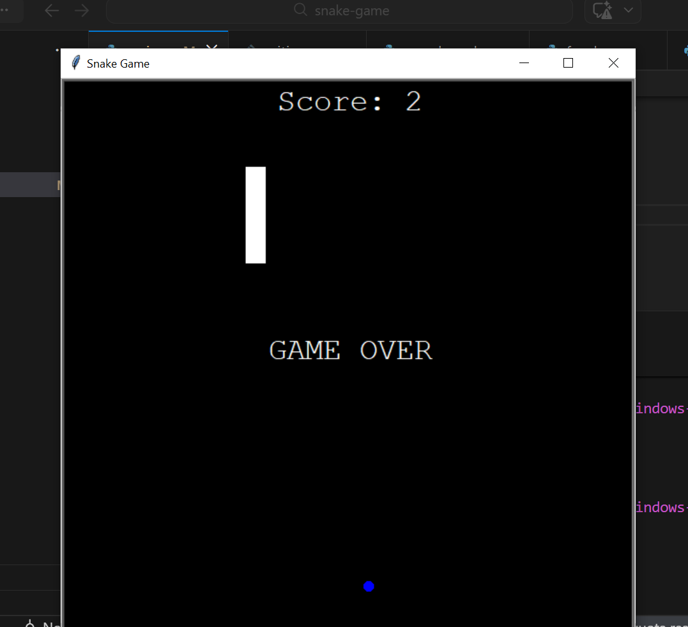

# 🐍 Snake Game in Python 🐍

```text
   ____             _        ____                      
  / ___|  __ _  ___| | __   / ___| __ _ _ __ ___   ___ 
 | |  _  / _` |/ __| |/ /  | |  _ / _` | '_ ` _ \ / _ \
 | |_| | (_| | (__|   <   | |_| | (_| | | | | | |  __/
  \____|\__,_|\___|_|\_\   \____|\__,_|_| |_| |_|\___|


🎮 About the Game

A classic Snake Game implemented in Python using Turtle Graphics and Object-Oriented Programming (OOP).
The player controls the snake, eats food, grows longer, and must avoid colliding with walls or itself.

🌟 Features
Developed using Python OOP concepts:
Classes for Snake, Food, and Game Logic
Encapsulation and modular design
Turtle Graphics for visual gameplay
Dynamic score tracking
Game Over on collision with walls or snake itself
Easy-to-understand and extensible code
🛠 Requirements
Python 3.x
turtle module (built-in with Python, no extra install required)
▶️ How to Run
Clone the repository:
git clone <your-repo-link>
Navigate to the project folder:
cd snake-game
Run the game:
python snake_game.py
Use the arrow keys to control the snake.
⌨️ Controls
Key	Action
Arrow Up	Move Up
Arrow Down	Move Down
Arrow Left	Move Left
Arrow Right	Move Right
🏗 OOP Structure
Snake Class: Manages snake segments, movement, and growth
Food Class: Handles food creation and random placement
Game Class: Controls game logic, collision detection, and scoring
⚡ Future Enhancements
Levels with increasing difficulty
High score saving
Sound effects for food consumption and game over
Add animated GIF of snake movement
📄 License

This project is licensed under the MIT License.
---
## Demo Screenshort
```markdown

---
Optional: Add a requirements.txt file:
# requirements.txt
# Turtle module is built-in with Python
